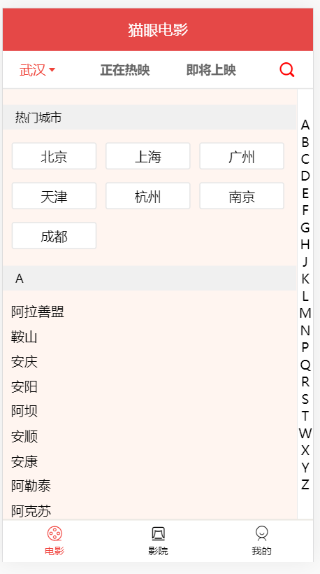
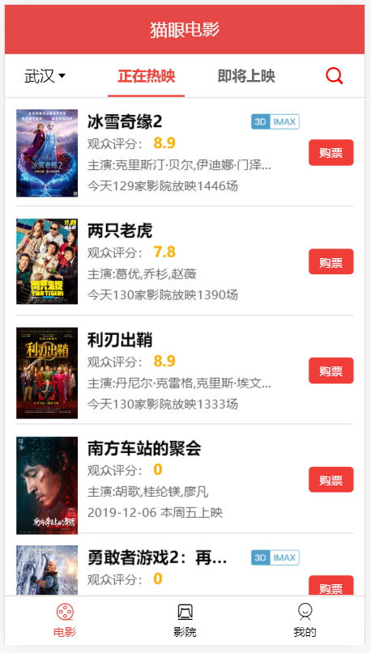
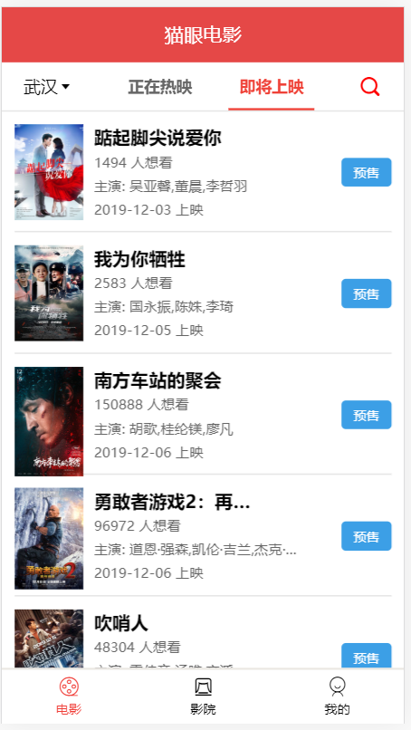
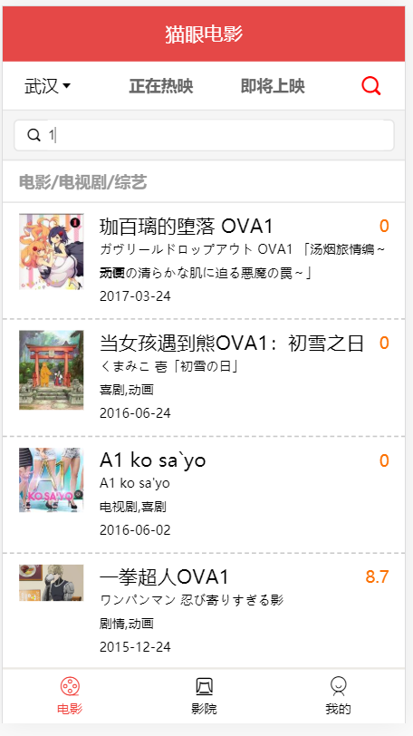
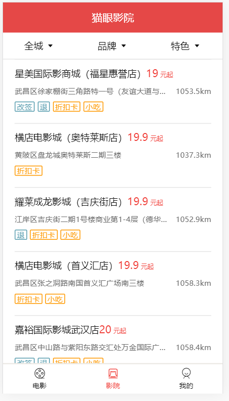
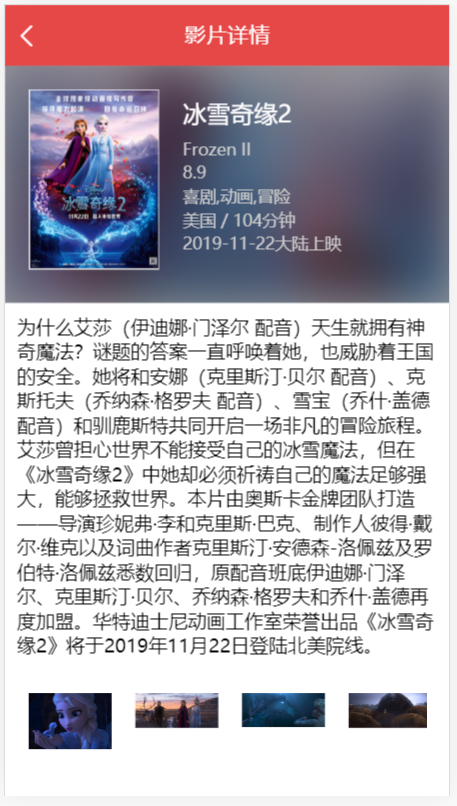
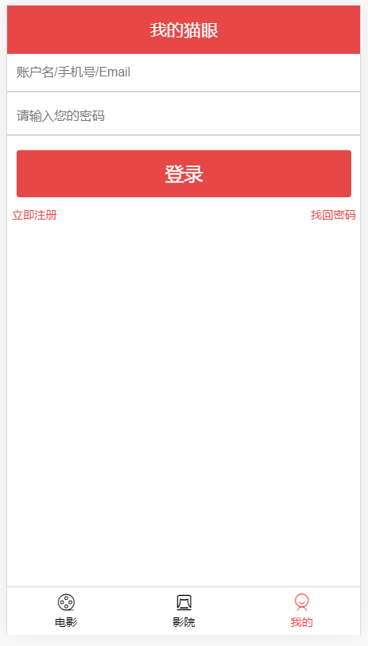

# 简介

## 1. 项目描述

1. 此项目为一个前后端分离的猫眼电影 Web App (SPA) 项目
2. 使用了 Vue 全家桶 + ES6 + axios 等前端最新技术 
3. 包括城市, 电影及电影详情, 搜索, 影院等多个功能子模块 
4. 采用模块化、组件化、工程化的模式开发 

## 2. 你能从此项目中学到什么? 

### 2.1 项目开发流程及开发方法 

1. 熟悉一个项目的开发流程
2. 学会组件化、模块化、工程化的开发模式 
3. 掌握使用 vue-cli 脚手架初始化 Vue.js 项目
4. 学会使用axios请求后端数据，实现前后端分离开发 
5. 学会 ES6+eslint 的开发方式 
6. 掌握一些项目优化技巧 

### 2.2 Vue 插件或第三方库

1. 学会使用 vue-router 开发单页应用 
2. 学会使用 axios 与后端进行数据交互
3. 学会使用 vuex 管理应用组件状态
4. 学会使用 better-scroll 实现页面滑动效果
5. 学会使用 vue-awesome-swiper 处理轮播滚动效果

## 3. API接口文档

[项目API接口文档](./接口文档.md)

## 4. 项目开发

[完整项目开发流程说明文档](./项目开发流程.md)

## 5. 运行项目

- `npm install`
- `npm run serve`

## 6. App演示截图

